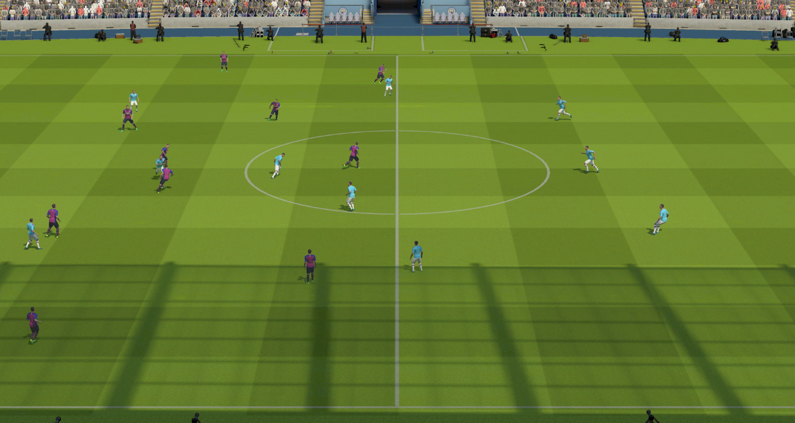
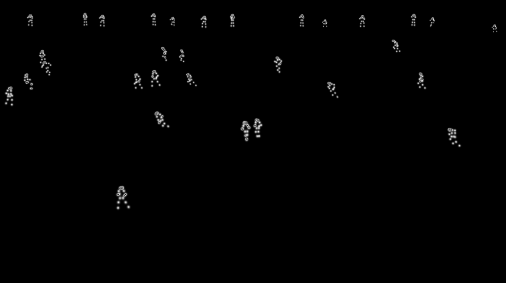
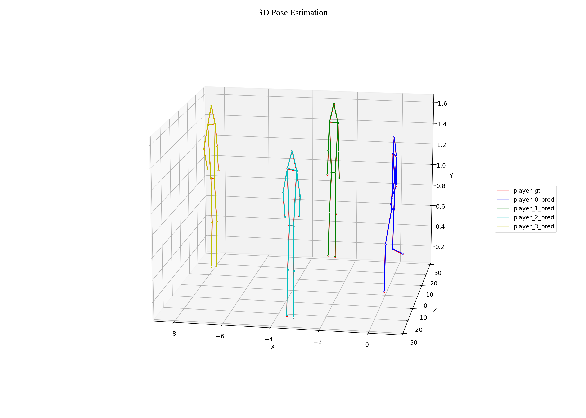
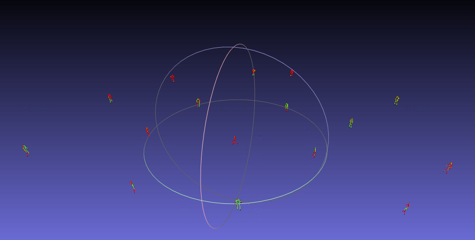
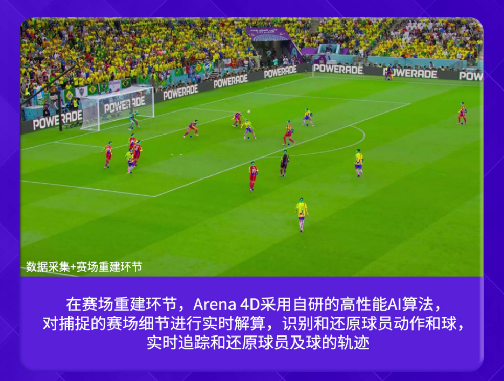
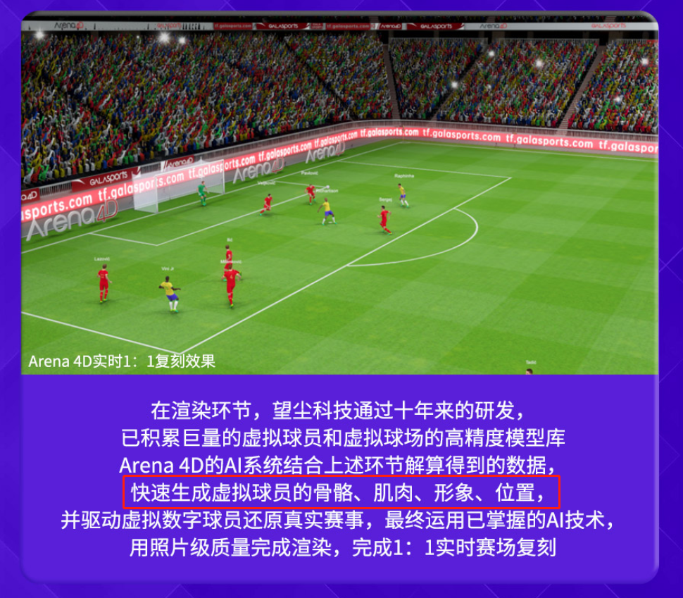

## Demo 7 6D Pose Estimation

Multi-view multi-person pose estimation

### Datasets

### 3D Keypoints

### **3D position prediction(red) vs. ground truth(green)**

- joints error ~= 0~10mm
- 
- 

### 3D rotation (Inverse Kinematics)

- IK
- Auto regressive

### Applications

- [Arena4D](https://galasports.com/news.html?id=188)
- 
- 

