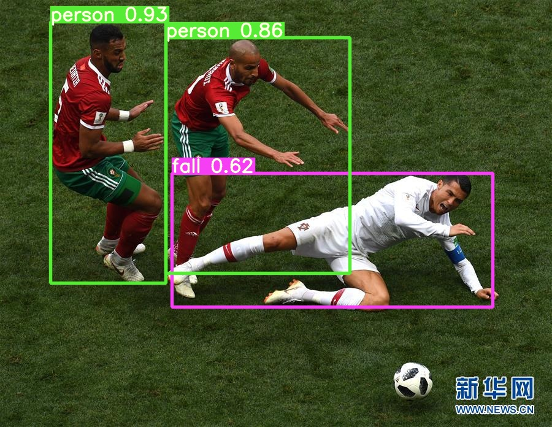

## Demo 11 IPC Object Detection

### Detection Labels

- 11 classes

```python
labels = ['person', 'infaint', 'elderly', 'package', 'fall', 'firesmoke', 'cat', 'dog', 'bus', 'truck', 'car']
```





### Tracking trial

- please wait for seconds


