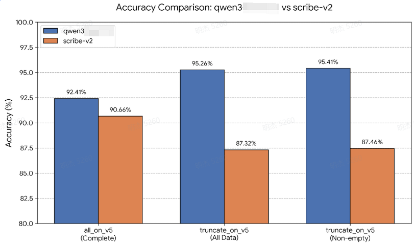
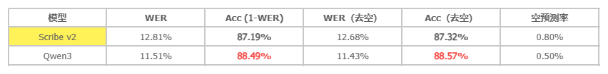
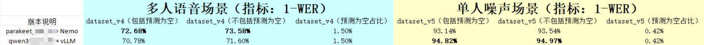
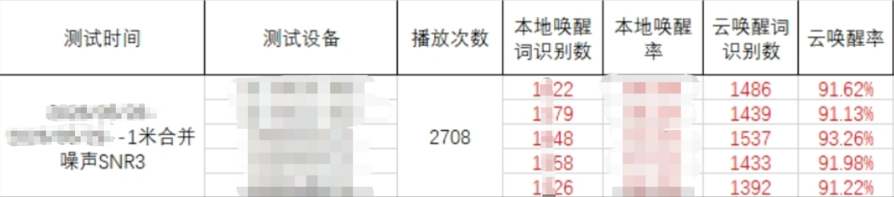
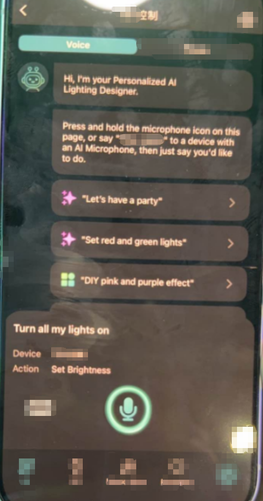

# 流式 ASR 系统研发与部署

> **项目角色**：**唯一**开发者（独自研发整套 ASR 算法与部署系统） 

## 业务贡献

系统已成功上线，核心性能指标均达到行业顶尖云厂商水平（英文语种测试）。

|           评估维度            |     ASR指标     |                    对比                     |
| :---------------------------: | :-------------: | :-----------------------------------------: |
| **识别准确率** (单人复杂噪声) |    **92%+**     | 优于 **Scribe-v2 (91%)**& Amazon (**90%**)  |
|    **流式推理速度** (RTFx)    |    **0.08**     | 基于 A100 GPU，**200ms** 可处理 **4s** 音频 |
|      **流式高并发支撑**       | **~60 路 / 卡** |        稳定支撑 WebSocket 长连接推理        |
|      **端到端传输延迟**       |   **< 100ms**   |         采用 Opus 音频压缩传输技术          |

- **对比（单人噪声）**
    - 合成数据集

- **真人数据集 (People’s Speech)**

    

- **对比（多人噪声）**

    - 72%+ 准确率

    

## 核心技术

### 1. ASR 模型调优

为确立最优基座，深度对比与压测了多款业界前沿模型，并针对性实施优化策略：

|     选型     |                         涉及模型                         |                           策略说明                           |
| :----------: | :------------------------------------------------------: | :----------------------------------------------------------: |
| **模型对比** |       `Qwen3-ASR`、`parakeet-v3`、**`scribe-v2`**        |           压测评估各模型在流式场景下的准度与吞吐。           |
|   **微调**   |    `parakeet-v3` canary-1b-flash`、`whisper-large-v3`    |               引入加噪数据集微调，提升鲁棒性。               |
| **热词增强** | Parakeet: `Phrase Boosting`、Qwen3: `Contextual Biasing` |       针对不同模型制定热词召回策略，提升专属词准确率。       |
| **空识别率** |                   流式为空降级离线推理                   | 针对 `<2s` 短音频唤醒，制定智能降级策略，有效降低误召回与漏召回。 |

- **热词增强（云端唤醒率）**

> 多人噪声场景下，基于自适应选择的云唤醒率平均94%+。

### 2. 复杂环境音频处理

|     处理模块     |       技术选型与创新点       | 解决的核心业务痛点 |
| :--------------: | :--------------------------: | :----------------: |
| **单人噪声增强** |       `MossFormerGAN`        | 有效提取有效频段。 |
|  **说话人分离**  |      `diar_sortformer`       | 解决多人抢话干扰。 |
|  **主讲人锁定**  | 声纹识别 + 响度/打断规则引擎 |  精准锁定主讲人。  |
|   **声源分离**   |        `MossFormer2`         | 剥离复杂背景音源。 |

### 3. 工程化与高性能部署

- **微服务流式架构**：采用 `Docker` + `FastAPI/gRPC` + `WebSocket` 构建端云协同架构。
- **极致推理加速**：全面引入 `vLLM` 框架加速，结合 `FP8` 量化技术。

## 应用落地

### **AI Microphone** & **AI Companion** 

