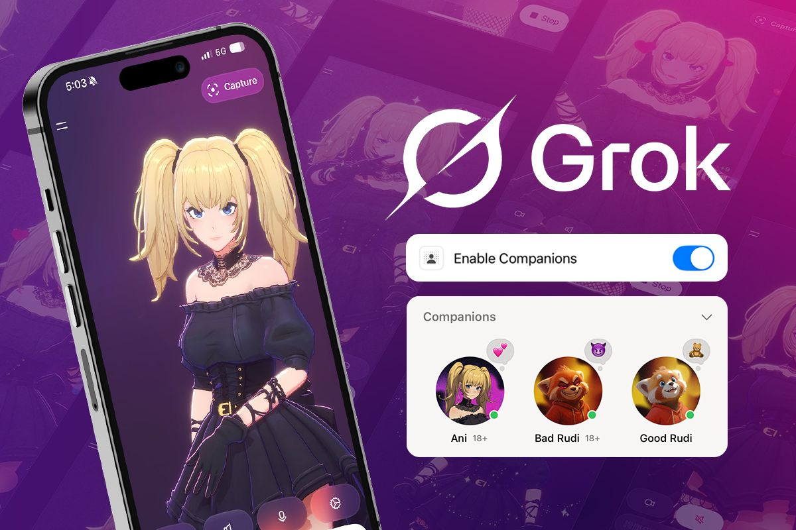
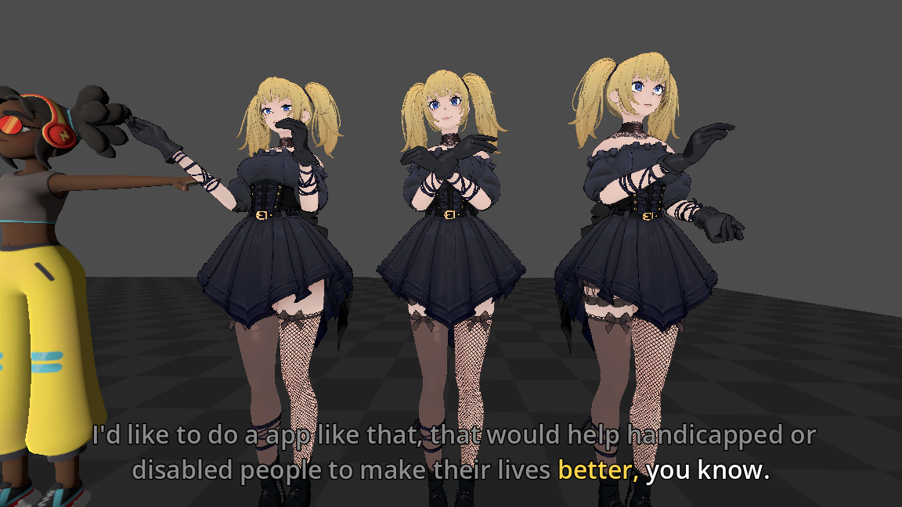

# 3D Avatar 项目

## 01 项目背景

**目标**: 对标 **Grok-Ani**, 做语音驱动的 3D avatar 全身手势 + 表情生成 (SMPL-X + ARKit52 blendshape).

## 02 训练改进

|      项目      |               路线               |                  角色                   |
| :------------: | :------------------------------: | :-------------------------------------: |
| **GestureLSM** | RVQ-VAE + Shortcut flow matching | 连续 latent, 2-step inference, **主线** |
|    **MECo**    | RVQ-VAE + **Qwen 2.5 0.5B GPT**  |  离散 token, autoregressive, **对照**   |

**输出**: `wav 16kHz → SMPL-X 55 joints + 100D expr + trans @ 30 FPS`, 兼容 ARKit52 blendshape.

**评估**: FGD (BEAT2 / Seamless 多 evaluator) .

### GLSM

- **数据集主导**

|             来源              |                 量                 |
| :---------------------------: | :--------------------------------: |
|         BEAT2 (官方)          |         240h, 30 speakers          |
| **Seamless Interaction** (主) | WebDataset, 30+ speakers, 对话场景 |

- **核心处理**

- WebDataset → SMPL-X 165D + 16k wav + onset/amp + textgrid
- VAD 过滤
- Word align: TextGrid → fasttext 300D (caption-mode) / WhisperX

### MECo

- **改进**: body RVQ + **face RVQ 双路** (jaw + eye + 100D expr 独立 codebook), GPT 同时学 motion + face token.
- 训练 6 步 (mean/std → vocab → detie → RVQ → mHuBERT dataset → Qwen-2.5b Stage1/2 )

## 03 最佳效果

### Godot

- 3D引擎：Godot / Blender
- 驱动：音频 wav
- 人体模型：SMPLX 重定向到 Godot Humanoid 骨架
- 面部模型：ARKit 52

### Demo

#### Talking

#### Dancing

